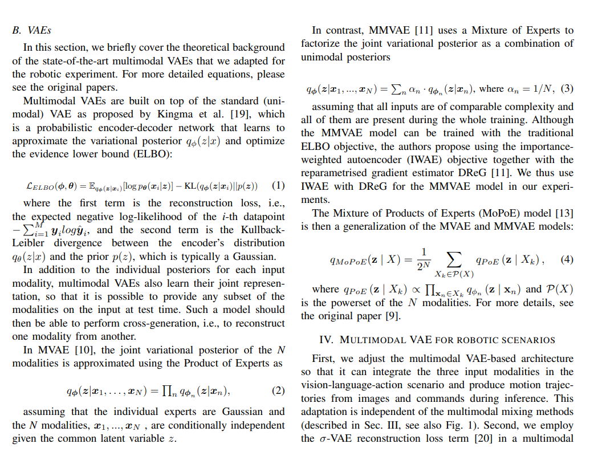
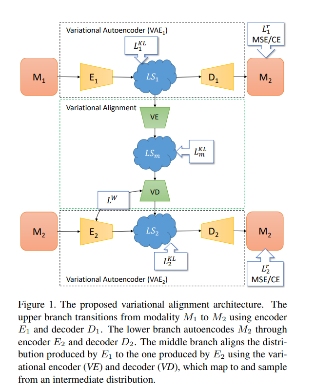

[Bridging Language, Vision and Action: Multimodal VAEs in Robotic Manipulation Tasks](https://arxiv.org/pdf/2404.01932v2)

[Cross-modal Variational Alignment of Latent Spaces](https://openaccess.thecvf.com/content_CVPRW_2020/papers/w56/Theodoridis_Cross-Modal_Variational_Alignment_of_Latent_Spaces_CVPRW_2020_paper.pdf)